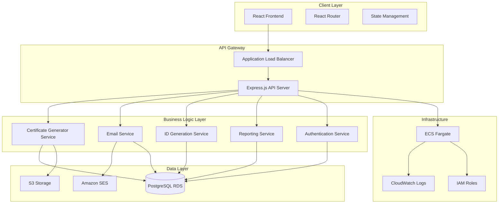

# Design Document

## Overview

The Certificate Management Platform (CMP) is a full-stack web application that integrates certificate generation, mass email distribution, and comprehensive analytics into a unified cloud-hosted solution. The platform builds upon the existing React/Node.js architecture while adding new capabilities for automated ID generation, multi-category event management, and detailed reporting.

## Architecture

### High-Level Architecture



### Technology Stack

**Frontend:**
- React 18 with functional components and hooks
- React Router for navigation
- Axios for API communication
- Material-UI or Tailwind CSS for UI components
- React Dropzone for file uploads
- Chart.js for analytics visualization

**Backend:**
- Node.js with Express.js framework
- JWT for authentication
- Multer for file handling
- PDF-lib for certificate generation
- Node-cron for scheduled tasks
- Winston for logging

**Database:**
- PostgreSQL (AWS RDS) for relational data
- Redis (AWS ElastiCache) for session management and caching

**Cloud Services:**
- AWS ECS Fargate for containerized deployment
- AWS S3 for file storage (certificates, templates)
- AWS SES for email delivery
- AWS RDS for database
- AWS CloudWatch for monitoring
- AWS Application Load Balancer for traffic distribution

## Components and Interfaces

### Frontend Components

#### 1. Dashboard Component
- **Purpose**: Main landing page with overview metrics
- **Props**: User authentication state, summary statistics
- **State**: Loading states, error handling
- **Features**: Quick access to all major functions, recent activity feed

#### 2. Certificate Generator Component
- **Purpose**: Handle file upload and certificate generation workflow
- **Props**: Event categories, template options
- **State**: Upload progress, generation status, preview data
- **Features**: Drag-and-drop file upload, data validation, batch processing

#### 3. Table Manager Component
- **Purpose**: Display and manage participant data with generated IDs
- **Props**: Participant data, certificate IDs
- **State**: Table data, sorting, filtering
- **Features**: Inline editing, export functionality, ID regeneration

#### 4. Email Campaign Component
- **Purpose**: Configure and execute mass email campaigns
- **Props**: Certificate batch data, email templates
- **State**: Campaign progress, delivery status
- **Features**: Template customization, scheduling, progress tracking

#### 5. Reports Dashboard Component
- **Purpose**: Display analytics and generate reports
- **Props**: Date ranges, filter criteria
- **State**: Chart data, export status
- **Features**: Interactive charts, date filtering, export options

### Backend Services

#### 1. Certificate Generation Service
```javascript
class CertificateService {
  async generateCertificates(participantData, templateId, eventCategories)
  async createCertificateIDs(count, eventPrefix)
  async validateParticipantData(csvData)
  async generatePDFCertificates(participants, template)
}
```

#### 2. ID Generation Service
```javascript
class IDGenerationService {
  async generateUniqueID(eventPrefix = 'SOU')
  async validateIDUniqueness(certificateID)
  async bulkGenerateIDs(count, eventPrefix)
  async getIDGenerationStats(dateRange)
}
```

#### 3. Email Service
```javascript
class EmailService {
  async sendBulkEmails(recipients, template, attachments)
  async trackEmailDelivery(campaignId)
  async getDeliveryStatistics(campaignId)
  async scheduleEmailCampaign(campaignData, scheduleTime)
}
```

#### 4. Reporting Service
```javascript
class ReportingService {
  async getCertificateStatistics(dateRange, categories)
  async getEmailCampaignMetrics(campaignIds)
  async generateEventCategoryReport(categories, dateRange)
  async exportReportData(reportType, format)
}
```

## Data Models

### Database Schema

#### Participants Table
```sql
CREATE TABLE participants (
  id SERIAL PRIMARY KEY,
  sr_no INTEGER,
  name VARCHAR(255) NOT NULL,
  email VARCHAR(255) NOT NULL,
  certificate_id VARCHAR(50) UNIQUE NOT NULL,
  batch_id INTEGER REFERENCES batches(id),
  created_at TIMESTAMP DEFAULT CURRENT_TIMESTAMP,
  updated_at TIMESTAMP DEFAULT CURRENT_TIMESTAMP
);
```

#### Batches Table
```sql
CREATE TABLE batches (
  id SERIAL PRIMARY KEY,
  name VARCHAR(255) NOT NULL,
  event_categories TEXT[], -- Array of categories
  template_id INTEGER REFERENCES templates(id),
  total_participants INTEGER,
  certificates_generated INTEGER DEFAULT 0,
  emails_sent INTEGER DEFAULT 0,
  created_by INTEGER REFERENCES users(id),
  created_at TIMESTAMP DEFAULT CURRENT_TIMESTAMP,
  status VARCHAR(50) DEFAULT 'pending'
);
```

#### Email Campaigns Table
```sql
CREATE TABLE email_campaigns (
  id SERIAL PRIMARY KEY,
  batch_id INTEGER REFERENCES batches(id),
  subject VARCHAR(500) NOT NULL,
  body_template TEXT NOT NULL,
  total_recipients INTEGER,
  emails_sent INTEGER DEFAULT 0,
  emails_delivered INTEGER DEFAULT 0,
  emails_failed INTEGER DEFAULT 0,
  scheduled_at TIMESTAMP,
  started_at TIMESTAMP,
  completed_at TIMESTAMP,
  status VARCHAR(50) DEFAULT 'draft'
);
```

#### Email Delivery Logs Table
```sql
CREATE TABLE email_delivery_logs (
  id SERIAL PRIMARY KEY,
  campaign_id INTEGER REFERENCES email_campaigns(id),
  participant_id INTEGER REFERENCES participants(id),
  email_address VARCHAR(255) NOT NULL,
  delivery_status VARCHAR(50), -- sent, delivered, bounced, failed
  delivery_time TIMESTAMP,
  error_message TEXT,
  ses_message_id VARCHAR(255)
);
```

#### Templates Table
```sql
CREATE TABLE templates (
  id SERIAL PRIMARY KEY,
  name VARCHAR(255) NOT NULL,
  description TEXT,
  template_data JSONB, -- Store template configuration
  file_path VARCHAR(500), -- S3 path to template file
  categories TEXT[], -- Applicable event categories
  is_active BOOLEAN DEFAULT true,
  created_at TIMESTAMP DEFAULT CURRENT_TIMESTAMP
);
```

#### Certificate ID Generation Log
```sql
CREATE TABLE certificate_id_logs (
  id SERIAL PRIMARY KEY,
  certificate_id VARCHAR(50) NOT NULL,
  generated_at TIMESTAMP DEFAULT CURRENT_TIMESTAMP,
  batch_id INTEGER REFERENCES batches(id),
  event_prefix VARCHAR(10) DEFAULT 'SOU'
);
```

### API Endpoints

#### Certificate Management
- `POST /api/certificates/upload` - Upload participant data
- `POST /api/certificates/generate` - Generate certificates for batch
- `GET /api/certificates/batch/:id` - Get batch details
- `PUT /api/certificates/batch/:id` - Update batch information
- `DELETE /api/certificates/batch/:id` - Delete batch

#### ID Generation
- `POST /api/ids/generate` - Generate certificate IDs for participants
- `POST /api/ids/bulk-generate` - Bulk generate IDs
- `GET /api/ids/validate/:id` - Validate ID uniqueness
- `GET /api/ids/stats` - Get ID generation statistics

#### Email Campaigns
- `POST /api/emails/campaign` - Create email campaign
- `POST /api/emails/send/:campaignId` - Send campaign emails
- `GET /api/emails/campaign/:id/status` - Get campaign status
- `GET /api/emails/delivery-stats/:campaignId` - Get delivery statistics

#### Reporting
- `GET /api/reports/dashboard` - Get dashboard statistics
- `GET /api/reports/certificates` - Get certificate generation reports
- `GET /api/reports/emails` - Get email campaign reports
- `POST /api/reports/export` - Export report data

#### File Management
- `POST /api/files/upload` - Upload files to S3
- `GET /api/files/download/:id` - Download files from S3
- `DELETE /api/files/:id` - Delete files from S3

## Error Handling

### Frontend Error Handling
- Global error boundary for React components
- Toast notifications for user feedback
- Retry mechanisms for failed API calls
- Graceful degradation for offline scenarios

### Backend Error Handling
- Centralized error middleware
- Structured error responses with error codes
- Logging integration with CloudWatch
- Circuit breaker pattern for external services

### Error Response Format
```javascript
{
  "success": false,
  "error": {
    "code": "VALIDATION_ERROR",
    "message": "Invalid participant data format",
    "details": {
      "field": "email",
      "value": "invalid-email",
      "constraint": "Must be valid email format"
    }
  },
  "timestamp": "2024-10-24T10:30:00Z",
  "requestId": "req-123456"
}
```

## Testing Strategy

### Unit Testing
- Jest for JavaScript unit tests
- React Testing Library for component tests
- Supertest for API endpoint testing
- Mock external services (AWS SES, S3)

### Integration Testing
- Database integration tests with test containers
- API integration tests with test database
- Email service integration tests with SES sandbox

### End-to-End Testing
- Cypress for full user workflow testing
- Test certificate generation and email flow
- Test reporting and analytics features

### Performance Testing
- Load testing for bulk certificate generation
- Stress testing for concurrent email sending
- Database performance testing for large datasets

### Security Testing
- Authentication and authorization testing
- Input validation and sanitization testing
- File upload security testing
- SQL injection prevention testing

## Deployment Architecture

### AWS Infrastructure
- **ECS Fargate**: Containerized application deployment
- **Application Load Balancer**: Traffic distribution and SSL termination
- **RDS PostgreSQL**: Multi-AZ database with automated backups
- **S3**: File storage with versioning and lifecycle policies
- **SES**: Email delivery with reputation monitoring
- **CloudWatch**: Logging, monitoring, and alerting
- **IAM**: Role-based access control

### Container Configuration
```dockerfile
# Multi-stage build for optimized production image
FROM node:18-alpine AS builder
WORKDIR /app
COPY package*.json ./
RUN npm ci --only=production

FROM node:18-alpine AS runtime
WORKDIR /app
COPY --from=builder /app/node_modules ./node_modules
COPY . .
EXPOSE 5000
CMD ["npm", "start"]
```

### Environment Configuration
- Development: Local Docker containers
- Staging: Single ECS service with shared RDS
- Production: Auto-scaling ECS services with dedicated RDS

### CI/CD Pipeline
- GitHub Actions for automated testing and deployment
- Docker image building and pushing to ECR
- Blue-green deployment strategy for zero-downtime updates
- Automated rollback on deployment failures

## Security Considerations

### Authentication & Authorization
- JWT-based authentication with refresh tokens
- Role-based access control (Admin, User, Viewer)
- OAuth integration for Google Workspace accounts
- Session management with secure cookies

### Data Protection
- Encryption at rest for database and S3 storage
- Encryption in transit with TLS 1.3
- PII data anonymization in logs
- GDPR compliance for data handling

### Input Validation
- Server-side validation for all inputs
- File type and size restrictions
- SQL injection prevention with parameterized queries
- XSS prevention with input sanitization

### Infrastructure Security
- VPC with private subnets for database
- Security groups with least privilege access
- WAF protection for web application
- Regular security updates and vulnerability scanning